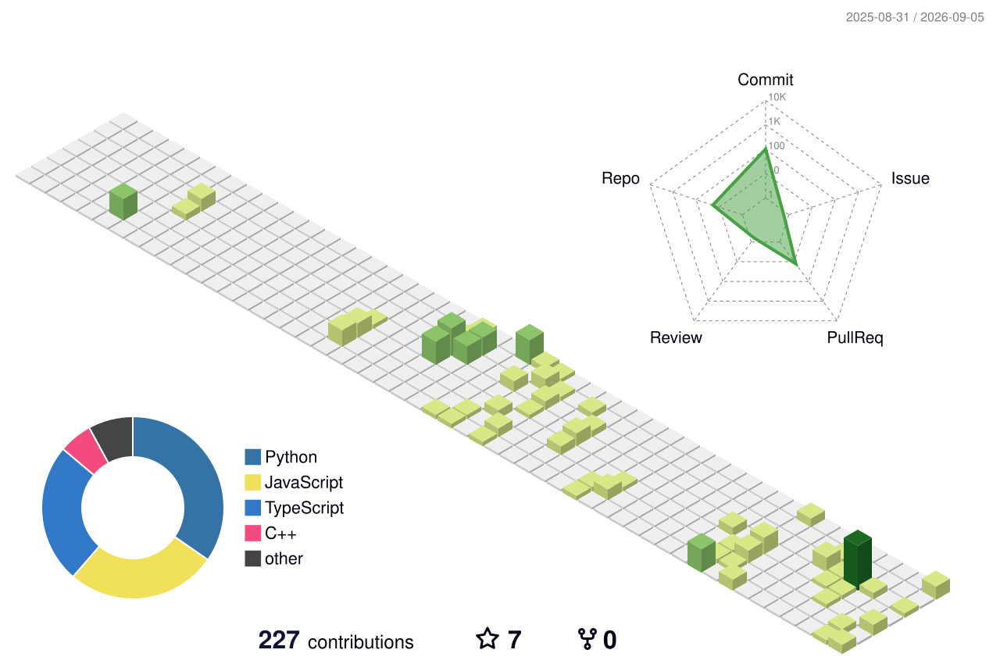

<div align="center">

# 👋 Hi, I'm Abdul Mannan

### Full-Stack Engineer · AI Engineer · Backend & System Design Enthusiast

I build **modern full-stack applications, AI-powered systems, and scalable backend architectures.**

<br />

<a href="https://github.com/mannan-op">
  
</a>

<a href="mailto:mannan4u3@gmail.com">
  
</a>

</div>

---

## 🧑‍💻 About Me

I'm a **Computer Science student and Full-Stack / AI Engineer** focused on building production-oriented software.

My current engineering focus is:

```text
Next.js
   +
NestJS
   +
PostgreSQL / Redis
   +
AI / LLMs
   +
System Design
        ↓
Scalable Full-Stack Applications
```

I enjoy working on problems involving **backend architecture, real-time systems, AI integrations, APIs, databases, and scalable SaaS platforms.**

---

## ⚡ What I Build

* 🤖 AI-powered applications
* 🧠 LLM & RAG systems
* ⚡ Real-time web applications
* 🏢 SaaS platforms
* 🔐 Secure REST APIs
* 📊 Admin & analytics dashboards
* 🗄️ Database-driven applications
* 🌐 Scalable full-stack systems

---

# 🛠️ Tech Stack

### Frontend

```text
Next.js · React · TypeScript · JavaScript · Tailwind CSS
```

### Backend

```text
NestJS · Node.js · Express.js · REST APIs · WebSockets
```

### Databases

```text
PostgreSQL · MongoDB · Redis · SQLite
```

### AI Engineering

```text
LLMs · RAG · AI Agents · Embeddings · Vector Search · AI Automation
```

### Tools & Infrastructure

```text
Git · GitHub · Linux · Docker · Postman
```

---

# 🚀 Featured Projects

<div align="center">

### 🧭 AI Pathfinder

AI-powered project focused on intelligent pathfinding and AI engineering.

**Python · AI**

<a href="https://github.com/mannan-op/AI-Pathfinder">
  
</a>

---

### 💬 MERN ChatApp

Real-time chat application built around the MERN ecosystem.

**MongoDB · Express · React · Node.js**

<a href="https://github.com/mannan-op/Mern-ChatApp">
  
</a>

---

### 🤖 Chatbot AI

AI-powered chatbot application built with TypeScript.

**TypeScript · AI**

<a href="https://github.com/mannan-op/chatbotAI">
  
</a>

---

### 🔎 FillingLens

AI-oriented application exploring intelligent document/data processing.

**TypeScript · AI**

<a href="https://github.com/mannan-op/FillingLens">
  
</a>

---

### 📚 RAG Chatbot

Retrieval-Augmented Generation chatbot exploring modern AI application architecture.

**TypeScript · RAG · LLM**

<a href="https://github.com/mannan-op/Rag_chatbot">
  
</a>

---

### 🖥️ XENO_OS

Operating-system / systems programming project built in C++.

**C++ · Systems Programming**

<a href="https://github.com/mannan-op/XENO_OS">
  
</a>

</div>

---

# 🧠 Engineering Interests

```text
┌─────────────────────────────────────────────┐
│              ENGINEERING FOCUS              │
├─────────────────────────────────────────────┤
│                                             │
│  Full-Stack Development                     │
│  Backend Architecture                       │
│  System Design                              │
│  Distributed Systems                        │
│  AI Engineering                             │
│  LLM Applications                           │
│  RAG & AI Agents                            │
│  Multi-Tenant SaaS                          │
│  Real-Time Systems                          │
│                                             │
└─────────────────────────────────────────────┘
```

---

# 🐍 Contribution Snake

<div align="center">

<picture>
  <source media="(prefers-color-scheme: dark)" srcset="./github-snake-dark.svg">
  <source media="(prefers-color-scheme: light)" srcset="./github-snake.svg">
  
</picture>

</div>

---

# 🧊 3D Contribution Graph

<div align="center">



</div>

---

# 📊 GitHub

<div align="center">

<a href="https://github.com/mannan-op?tab=repositories">
  
</a>

<a href="https://github.com/mannan-op?tab=stars">
  
</a>

</div>

---

# 📚 Currently Learning

```text
Next.js
   ↓
NestJS
   ↓
PostgreSQL
   ↓
Redis
   ↓
System Design
   ↓
Distributed Systems
   ↓
AI Engineering
   ↓
Production Architecture
```

---

# 💡 Engineering Philosophy

> **Build simple. Understand deeply. Scale when necessary.**

I'm interested in understanding not only **how to build software**, but also **why systems are designed the way they are**.

---

<div align="center">

### 🚀 Build · Learn · Ship · Improve

<br />

**Thanks for visiting my profile!**

</div>
